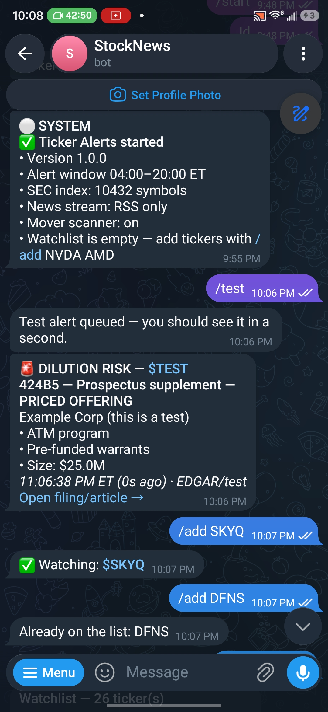
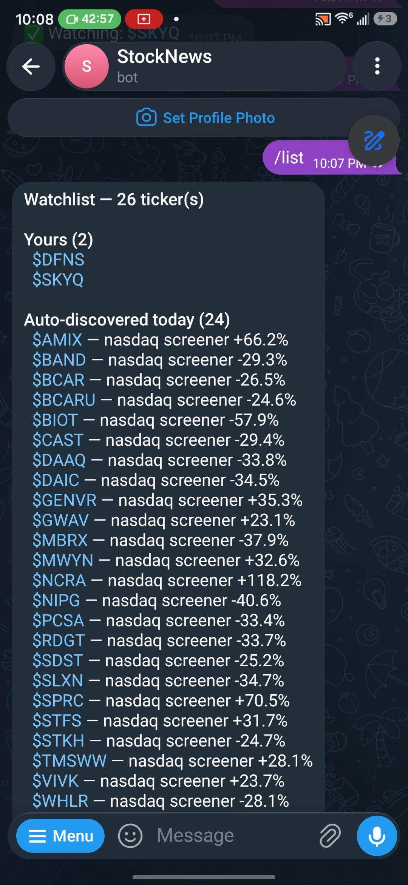
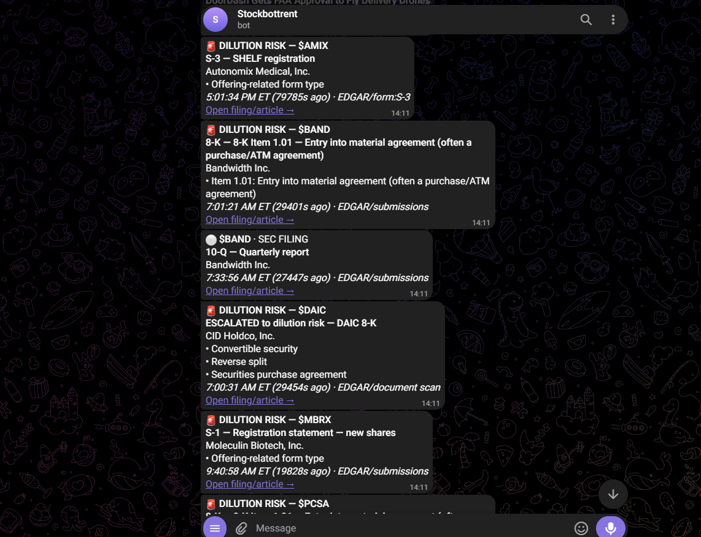

# Ticker Alerts

Reads SEC filings straight from EDGAR and pushes dilution warnings to Telegram
in seconds — including the offerings that never produce a headline at all.

<p align="center">
  
  
</p>

<sub><b>Left:</b> a dilution alert with the offering size and structure pulled
out of the filing document, delivered <code>0s</code> after detection — plus the
whole watchlist managed from the chat. <b>Right:</b> <code>/list</code> — your
own tickers, and the 24 the scanner found moving that day on its own.</sub>

---

## Why this beats X, Webull, and news apps

**The dilution that hurts you is silent.**

When a company does an at-the-market offering or takes down a shelf, it very
often issues no press release. Nothing is announced. A `424B5` appears on
EDGAR, the shares start hitting the tape, and the first thing you see is your
position bleeding for no visible reason.

News aggregators can only aggregate news that exists. If no story was ever
published, there is nothing for Webull, Yahoo, or your broker's feed to show
you. That is not a speed problem — the information is simply absent from those
products. It exists in exactly one place: the filing.

This reads the filing.

| | What it actually gives you |
|---|---|
| **X / Twitter** | A human has to notice the filing and post it. For small caps, often nobody does — and when they do, the move already happened. You're reading someone else's read of the same EDGAR page, minutes to hours later. |
| **Webull / broker feeds** | Headline aggregation. Filings live in a tab you have to remember to open, not a push alert. A silent ATM produces no headline, so it produces no notification. |
| **Paid terminals** ($200+/mo) | Genuinely fast on *headlines*. Filing coverage is usually a separate, pricier product — and they still won't tell you what's inside the document. |
| **This** | Polls EDGAR directly every few seconds, classifies by form type and 8-K item code, then **opens the document and reads it**. |

**That last part is the real difference.** No news feed tells you a filing
contains a $200M ATM program with pre-funded warrants attached. That requires
reading the prospectus. This does it automatically, in about a second, and
sends you the summary.

A real example from testing — this 8-K looked routine on form type alone, then
the document scan changed the verdict:

> 🚨 **DILUTION RISK — $DAIC**
> **ESCALATED to dilution risk — DAIC 8-K**
> CID Holdco, Inc.
> • Convertible security
> • Reverse split
> • Securities purchase agreement

A headline feed would have shown you "CID Holdco files 8-K", if it showed you
anything.

**Honest about what it isn't:** a dedicated newswire licence will beat this by
a few seconds on *headlines*. It will not beat it on filings, and filings are
what cost you money.

---

**What it watches**

- **SEC filings** — offerings, shelf registrations, ATMs, prospectus
  supplements, PIPEs, reverse splits. Three independent detection paths so a
  single feed outage can't cause a miss.
- **Breaking news and press releases** for every ticker on your list.
- **General NASDAQ / AI sector headlines**.
- **The day's movers** — found automatically, watched for the session, cleared
  at the close. You don't maintain a list of what's in play; it finds them.

**How you control it** — entirely by messaging the Telegram bot. `/add NVDA`,
`/remove NVDA`, `/list`. No files to edit, no redeploy.

---

## Running cost: $0/month

Every data source is free. There is no paid feed anywhere in this system.

| What | Source | Cost |
|---|---|---|
| SEC filings | SEC EDGAR directly | Free, no account |
| Real-time news | Alpaca news websocket (Benzinga-sourced) | Free, paper account |
| Press releases | GlobeNewswire, Business Wire, PR Newswire RSS | Free |
| Per-ticker news | Yahoo Finance RSS | Free |
| Sector news | Google News RSS | Free |
| Movers scan | Alpaca screener, Nasdaq fallback | Free |
| Alerts | Telegram Bot API | Free |
| Hosting | Your existing VPS | ~$0 marginal (uses ~100 MB RAM) |

The only thing faster than this for filings is the SEC's Public Dissemination
Service, which is roughly $25,000/year and aimed at institutions. Polling EDGAR
directly puts you within about a minute of filing acceptance, which is the same
information most paid retail terminals are working from.

**If you ever want to upgrade** (you don't need to):

| Upgrade | Cost | What it actually buys |
|---|---|---|
| Polygon.io Stocks Starter | $29/mo | Better intraday mover detection. Nothing for filings. |
| Benzinga Newsfeed licence | ~$200+/mo | A few seconds on headlines. Nothing for filings. |

---

## Setup

You need three things. Budget about 20 minutes.

### 1. Make the Telegram bot

> **Handing this to someone else to do?** Send them
> **[CLIENT-SETUP.md](CLIENT-SETUP.md)** — it's the same steps written for a
> non-technical reader, plus the everyday commands.

1. Open Telegram, search for **@BotFather**, start a chat.
2. Send `/newbot`. Pick any name, then a username ending in `bot`.
3. He replies with a token like `8123456789:AAF...`. **Copy it as text.**
4. Now search for **@userinfobot** and send it any message. It replies with
   your numeric `Id`. **Copy that too.**
5. Finally, find your new bot by its username and press **Start** — Telegram
   won't let a bot message you until you've done this once.

> ⚠️ Copy the token as **text**, never a screenshot. In most fonts `0`/`O` and
> `1`/`l` are indistinguishable, and a single wrong character gives you a
> silent `Unauthorized`. This bit us during development.

### 2. Make a free Alpaca account (optional but recommended)

This gives you the real-time news stream. It is free, a **paper** account is
fine, and you never fund it.

1. Sign up at <https://alpaca.markets>.
2. On the dashboard, click **Generate API Keys**.
3. Copy the Key ID and the Secret.

Skip this and everything still works — you just fall back to RSS news, which
runs about 30–60 seconds behind.

### 3. Install on the server

SSH into the same VPS that runs meshToParametric and the operator dashboard.

```bash
cd /opt
git clone <your-repo-url> ticker-alerts     # or upload the folder
cd ticker-alerts

cp .env.example .env
nano .env
```

Fill in these four lines and save (`Ctrl+O`, Enter, `Ctrl+X`):

```
TELEGRAM_BOT_TOKEN=8123456789:AAF...
TELEGRAM_CHAT_IDS=123456789
SEC_USER_AGENT=Your Name your@email.com
ALPACA_API_KEY=PK...
ALPACA_API_SECRET=...
```

> `SEC_USER_AGENT` is not optional. The SEC requires automated requests to
> identify themselves with a real name and email, and will throttle or block
> you without it.

Then check everything works before you start it:

```bash
docker compose build
docker compose run --rm ticker-alerts python -m app.selftest --telegram
```

You should see a list of green `OK` lines and get a test message on your phone.
If anything says `FAIL`, look it up in [RUNBOOK.md](RUNBOOK.md).

Start it:

```bash
docker compose up -d
```

You'll get a "Ticker Alerts started" message. Now add your tickers:

```
/add NVDA AMD SMCI PLTR
```

That's it.

---

## Using it

Message the bot:

| Command | What it does |
|---|---|
| `/add NVDA AMD` | Watch these tickers |
| `/remove NVDA` | Stop watching |
| `/list` | Everything currently watched, yours and auto-discovered |
| `/status` | Is every feed alive, when did each last work |
| `/movers` | The scanner's latest top movers |
| `/recent` | Last 10 alerts sent |
| `/mute 60` | Quiet non-critical alerts for an hour |
| `/unmute` | Back on |
| `/test` | Send yourself a fake dilution alert |

The slash is optional — `add nvda` works.

### What the alerts look like

Dilution risk (the one that matters):

> 🚨 **DILUTION RISK — $RDGT**
> **424B5 — Prospectus supplement — PRICED OFFERING**
> Ridgetech Inc.
> • Offering-related form type
> *9:00:11 AM ET (14s ago) · EDGAR/submissions*
> [Open filing →]

Then, a second or two later, once it has read the document:

> 🟠 **$RDGT** · SEC FILING
> **424B5 details — RDGT**
> • Size: $200,000,000
> • ATM program
> • Shelf registration
> • Warrants attached
> • Securities purchase agreement

The first message is sent on form type alone so it goes out as fast as
possible. Reading the actual document takes another second, so that becomes a
follow-up rather than a delay.

A batch of real filings, as delivered:



<sub>Captured during a detection test that replayed the day's earlier filings,
which is why the `(…s ago)` ages are large — in live operation these arrive
within about a minute of the SEC accepting the filing. Note `$DAIC`: that 8-K
read as routine on form type, and only became a dilution warning after the
document scan found a convertible security, a reverse split, and a securities
purchase agreement.</sub>

### Alert levels

| | Meaning | Behaviour |
|---|---|---|
| 🚨 | Dilution / offering | Always sent, **even when muted or outside hours** |
| 🟠 | Material event worth reading now | Normal |
| 🔵 | Headline | Normal |
| ⚪ | Routine | Silent notification |

---

## What runs when

Alerts fire **4:00am – 8:00pm ET, seven days a week**. Offerings are very often
priced after the close or announced pre-market, which is exactly when you'd
otherwise get caught.

Dilution filings ignore the window entirely — a 🚨 will reach you at 2am if the
SEC accepts one at 2am.

Auto-discovered movers are added through the session and cleared at 8pm, so
tomorrow starts on just your own list.

---

## Keeping it running

```bash
docker compose logs -f              # watch it work
docker compose restart              # restart
docker compose down                 # stop
docker compose up -d --build        # update after a code change
curl -s localhost:8087 | head -40   # health snapshot as JSON
```

Your watchlist and alert history live in `./data/alerts.db`. To back it up:

```bash
cp data/alerts.db ~/alerts-backup.db
```

Restarting never replays old alerts — every filing is deduplicated by its SEC
accession number, permanently.

**The system watches itself.** If any feed stops working during market hours
you get a ⚠️ FEED PROBLEM message telling you which one and how long it's been
down. You also get a short summary each evening confirming it's alive. Silence
from this system means nothing happened — not that it died.

If something looks wrong, start with [RUNBOOK.md](RUNBOOK.md).

---

## How it works

```
                    ┌──────────────────────────────┐
  SEC EDGAR ───────►│ 1. global "latest filings"   │
                    │ 2. per-form feeds (424B5...) │──┐
                    │ 3. per-company submissions   │  │
                    └──────────────────────────────┘  │
                                                      ▼
  Alpaca websocket ──────────────────────────►  ┌───────────┐
  PR wires / Yahoo / Google News RSS ────────►  │ dedupe by │
  Mover scanner ─────────────────────────────►  │ accession │
                                                └─────┬─────┘
                                                      ▼
                                              ┌───────────────┐
                                              │  classifier   │
                                              │ form + text   │
                                              └───────┬───────┘
                                                      ▼
                                          ┌───────────────────────┐
                                          │ priority queue        │
                                          │ dilution first        │
                                          └───────────┬───────────┘
                                                      ▼
                                                  Telegram
```

Three SEC paths run at once and all deduplicate against the same ledger, so
missing a filing takes three simultaneous failures rather than one. Each source
runs as an isolated task — if Yahoo's RSS goes down, the SEC pollers don't
notice.

| File | What it does |
|---|---|
| `app/main.py` | Starts and supervises every task |
| `app/sources/sec.py` | The three EDGAR detection paths |
| `app/sources/news_alpaca.py` | Real-time news websocket |
| `app/sources/news_rss.py` | Wires, per-ticker and sector RSS |
| `app/sources/movers.py` | Daily mover discovery |
| `app/classify.py` | Form types, 8-K item codes, dilution language |
| `app/alerts.py` | Priority queue, formatting, dispatch |
| `app/telegram_bot.py` | Sending and the `/add` `/remove` commands |
| `app/health.py` | Watchdog, daily summary, health endpoint |
| `app/store.py` | SQLite: watchlist, dedup ledger, history |
| `app/selftest.py` | `python -m app.selftest` — checks every upstream |

### Tuning

Everything below is in `.env`; restart with `docker compose up -d` after a
change. The defaults are tuned already — the ones most worth knowing about:

| Setting | Default | Meaning |
|---|---|---|
| `MOVERS_MIN_PCT` | `6.0` | % move needed to auto-watch a name |
| `MOVERS_MAX_TICKERS` | `25` | Cap on auto-discovered names |
| `FILTER_OPINION` | `true` | Drop "Should You Buy X?" content-farm articles |
| `SEC_WIDE_NET` | `false` | Alert on offerings from companies *not* on your list. Leave off — 424B2 alone runs ~230 filings/hour, nearly all bank structured notes. |
| `ALERT_START_HOUR` / `ALERT_END_HOUR` | `4` / `20` | Alert window, Eastern |
